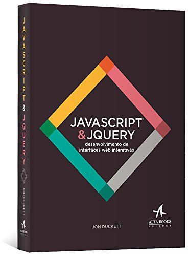

📚 Implementacao_Sass_WEB1: Estilizando uma Página de Livros com SCSS
🎯 Problema/Objetivo
O desenvolvimento de interfaces web frequentemente esbarra na complexidade e repetitividade do CSS puro, especialmente em projetos de maior escala. Gerenciar um volume crescente de estilos pode levar a arquivos CSS extensos, difíceis de manter e propensos a duplicação de código.

Este mini projeto visa resolver esse problema, demonstrando a aplicação prática do SCSS (Sass) como uma solução eficiente para otimizar e organizar a estilização de páginas web. Nosso principal objetivo é:

Ilustrar as funcionalidades-chave do SCSS: Focaremos no uso de variáveis para padronização, aninhamento de seletores para melhor legibilidade e organização, e o processo de compilação automatizada para CSS.

Desenvolver uma página de livros responsiva: Criaremos uma interface simples e funcional para exibir uma coleção de livros, aplicando os conceitos do SCSS para garantir um design coeso e adaptável a diferentes tamanhos de tela.

Ao final deste tutorial, você compreenderá como o SCSS pode transformar seu fluxo de trabalho, resultando em um código de estilo mais limpo, modular e fácil de manter.

🧪 Material e Métodos Utilizados para o Desenvolvimento
Para a implementação deste projeto, utilizamos uma abordagem passo a passo, seguindo as melhores práticas de desenvolvimento front-end com ênfase na utilização do SCSS.

🛠️ Tecnologias e Ferramentas
Ferramenta	Descrição
HTML5	Linguagem de marcação para estruturar o conteúdo da página, garantindo semântica e acessibilidade.
SCSS (Sass)	Pré-processador CSS essencial para escrever estilos de forma mais organizada e dinâmica.
CSS3	Linguagem de estilo que os navegadores interpretam. O styles.css é gerado a partir do styles.scss.
Node.js e npm	Ambiente de execução e gerenciador de pacotes para instalar e operar o compilador Sass.
Visual Studio Code (VS Code)	Editor de código principal, escolhido por sua leveza, extensibilidade e suporte integrado.
Live Server (Extensão VS Code)	Permite pré-visualizar as alterações no navegador em tempo real, agilizando o desenvolvimento.

Exportar para as Planilhas
💻 Instalação e Configuração do Ambiente
Siga estes passos para configurar seu ambiente de desenvolvimento:

Instale o Visual Studio Code (VS Code)

Motivo: Um editor de código robusto e gratuito com vasta gama de extensões.

Como: Baixe o instalador no site oficial e siga as instruções de instalação.

Instale Node.js e npm

Motivo: Necessário para instalar o compilador Sass via npm.

Como: Faça o download da versão LTS (Long Term Support) no site oficial do Node.js. O npm é incluído na instalação. Verifique a instalação abrindo seu terminal e digitando node -v e npm -v.

Instale a Extensão Live Server no VS Code

Motivo: Permite recarregamento automático do navegador ao salvar alterações.

Como: Abra o VS Code, vá para a aba Extensões (Ctrl+Shift+X), procure por "Live Server" (Autor: Ritwick Dey) e clique em Install.

Instale Sass via npm

Motivo: O compilador que transformará seus arquivos .scss em .css.

Como: Abra o terminal integrado do VS Code (Ctrl+' ou View > Terminal) ou o terminal do seu sistema operacional e execute:
npm run observar

Este comando instala o Sass globalmente, permitindo que você use o comando sass em qualquer diretório.

🚀 Passo a Passo para o Desenvolvimento
Com o ambiente configurado, vamos ao desenvolvimento do projeto:

1. Estrutura do Projeto
Crie a seguinte estrutura de arquivos e diretórios na raiz do seu projeto:

seu-projeto/
├── imagens/
│   ├── fundo.jpg
│   ├── l1.jpg
│   ├── l2.jpg
│   ├── l3.jpg
│   ├── l4.jpg
│   ├── alissin.png
│   ├── GALAS.PNG
│   ├── jacson.png
│   └── marelo.png
├── scss/
│   └── _variaveis.scss  (Partial SCSS)
├── index.html
├── styles.scss
└── styles.css           (Gerado pelo Sass)
imagens/: Contém todos os recursos visuais (capas de livros, fotos de perfil).

scss/: Diretório para arquivos SCSS parciais.

_variaveis.scss: Armazena variáveis de cor, fonte, etc., para reutilização.

index.html: O esqueleto HTML principal da página.

styles.scss: O arquivo SCSS principal onde a lógica de estilização será escrita.

styles.css: O arquivo CSS de saída, gerado automaticamente pelo compilador Sass. Não edite este arquivo manualmente.

2. Criando o index.html
Cole o código HTML abaixo no seu arquivo index.html. Ele define a estrutura da página, incluindo cabeçalho, a seção da biblioteca de livros e o rodapé.

HTML

<!DOCTYPE html>
<html lang="pt-br">

<head>
    <title>Página Principal</title>
    <link rel="shortcut icon" href="imagens/fundo.jpg" type="image/x-icon">
    <link rel="stylesheet" href="styles.css" />
</head>

<body>
    

        <h1>Utilizando SCSS para estilizar a página de livros da BSI</h1>
        <h3>Esta página é voltada para mostrar LIVROS</h3>
    

    

        

            
            <h2>Fundamentos de Desenvolvimento Web e Back-end</h2>
            

                Fundamentos de Desenvolvimento Web e Back-end", da Editora Senac, é um guia prático sobre a
                infraestrutura
                que sustenta aplicações web. Com foco em soluções para o mercado, o livro aborda de forma objetiva a
                lógica,
                os bancos de dados e a arquitetura do lado do servidor. É ideal para iniciantes e profissionais que
                buscam
                uma base sólida para criar sistemas web eficientes.
            

        

        

            
            <h2>JavaScript & Jquery</h2>
            

                JavaScript & JQuery: Desenvolvimento de Interfaces Web Interativas" é um guia famoso por ensinar
                programação
                de forma visual e intuitiva. Com um design colorido e infográficos, ele desmistifica os fundamentos do
                JavaScript e o uso da biblioteca JQuery para criar animações e interatividade em sites. É ideal para
                designers,
                iniciantes em programação e desenvolvedores front-end que preferem um aprendizado menos tradicional e
                mais
                prático.
                

            

        

        

            
            <h2>Estruturas De Dados</h2>
            

                Estruturas de Dados" de Paulo Veloso é um livro clássico da computação brasileira, focado nos
                fundamentos da
                "programação não numérica". A obra apresenta as estruturas mais importantes como listas, árvores e
                grafos,
                sendo o resultado de anos de experiência em sala de aula dos autores. É um texto denso e formal, voltado
                para quem já possui conhecimentos básicos de programação e busca uma base teórica robusta.
            

        

        

            
            <h2>Plano de Carreira</h2>
            

                Neste livro, Djalma de Oliveira adapta o planejamento estratégico empresarial para a gestão da carreira
                individual.
                Ele fornece um método prático para que o profissional defina seus objetivos, analise o mercado e trace
                metas para
                alcançar o sucesso. O objetivo é que você se torne o gestor de sua própria trajetória profissional de
                forma estruturada
                e planejada.
            

        

    

    

        

            

                
                GUSTAVO RODRIGUES MOREIRA
            

            

                
                JACSON FRANCISCO VIANA SANTOS
            

            

                
                ALISSON RICADY MORAIS GUIMÃRAES
            

            

                
                FELIPE PEREIRA DE LIMA
            

        

    

</body>

</html>

3. Definindo Variáveis com scss/_variaveis.scss
Crie o arquivo _variaveis.scss dentro da pasta scss/. Este parcial Sass centraliza a definição de valores reutilizáveis, como cores e fontes, facilitando a consistência e manutenção.

SCSS

// variaveis
$fundo: rgb(36, 36, 87);
$texto-fora-da-div: rgb(173, 197, 209);
$cor-texto-dentro-da-div: #ff00a6;
$cor-rodape: rgb(36, 36, 87);
$cor-texto: #000000;
$fonte: 'Arial', sans-serif;

4. Escrevendo os Estilos com styles.scss
No arquivo styles.scss, você importará as variáveis e escreverá os estilos, aproveitando os recursos do SCSS.

SCSS

// Importa as variáveis do arquivo _variaveis.scss
@import 'scss/variaveis';

body {
    background-color: $fundo;
    color: $texto-fora-da-div;
    background-size: cover;
    font-family: $fonte;
}

.cabecalho {
    display: flex;
    justify-content: center;
    align-items: center;
    text-align: center;
    flex-direction: column;
}

.biblioteca {
    display: grid;
    grid-template-columns: repeat(auto-fit, minmax(300px, 1fr));
    gap: 20px;
    padding: 20px;
    margin: auto;

    .livro { // Aninhamento de seletores para maior legibilidade
        background-color: white;
        border: 1px solid #ccc;
        padding: 15px;
        border-radius: 10px;

        img {
            width: 100%;
            height: auto;
            border-radius: 5px;
        }

        h2 {
            color: $cor-texto-dentro-da-div; // Uso de variável para cor do título
        }

        p {
            color: $cor-texto; // Uso de variável para cor do parágrafo
        }
    }
}

.rodape {
    display: flex;
    justify-content: center;
    align-items: center;
    text-align: center;
    flex-direction: column;
    background-color: $cor-rodape; // Uso de variável para cor do rodapé
    padding: 20px;
 
    .imagensRodape { // Aninhamento de seletores
        display: flex;
        gap: 16px;
        justify-content: center;
        margin-top: 10px;

        .integrante { // Aninhamento para estilos dos integrantes
            display: flex;
            flex-direction: column;
            align-items: center;
            gap: 5px;
            font-size: 0.8em;
            color: $texto-fora-da-div; // Cor dos nomes dos integrantes

            img {
                width: 60px;
                height: 60px;
                border-radius: 50%;
                object-fit: cover;
                border: 2px solid $cor-texto-dentro-da-div; // Borda da imagem
                box-shadow: 0 2px 8px rgba(0, 0, 0, 0.08);
                transition: transform 0.2s;

                &:hover { // Pseudoclasse aninhada para efeito hover
                    transform: scale(1.1);
                }
            }
        }
    }
}
Principais Características do SCSS Utilizadas:

@import 'scss/variaveis';: Modulariza o código, importando o arquivo de variáveis.

Aninhamento de Seletores: Reflete a estrutura HTML, tornando o CSS mais legível e reduzindo a repetição. Por exemplo, .biblioteca .livro é aninhado como .biblioteca { .livro { ... } }.

Variáveis ($): Centralizam valores como cores ($fundo, $cor-texto-dentro-da-div) e fontes ($fonte), facilitando alterações globais e garantindo consistência visual.

Pseudoclasses Aninhadas (&:hover): Permite aplicar estilos de estado (:hover, :focus) diretamente dentro do seletor do elemento, mantendo a coesão do código.

5. Compilando o SCSS para CSS
Para que o navegador interprete seus estilos SCSS, eles devem ser compilados para CSS. Utilize o comando sass --watch para automatizar este processo em tempo real.

Abra o terminal (integrado no VS Code ou do seu sistema) na raiz do seu projeto.

Execute o comando:

npm run observar
Monitora o styles.scss para alterações e recompila automaticamente.

styles.scss: Arquivo SCSS de entrada.

styles.css: Arquivo CSS de saída, gerado e atualizado.

Mantenha este terminal aberto enquanto estiver desenvolvendo.

6. Visualizando o Projeto
Com o comando npm run observar ativo e todas as imagens na pasta imagens/, visualize sua página:

No VS Code, clique com o botão direito no index.html e selecione "Open with Live Server".

Isso abrirá a página em seu navegador e a manterá atualizada automaticamente.

✅ Resultados Alcançados
O projeto final demonstra com sucesso a aplicação de SCSS para criar uma página de livros responsiva e bem estilizada. As principais características e resultados incluem:

Estilização Consistente: O uso de variáveis SCSS garantiu que cores e fontes fossem aplicadas de forma uniforme em toda a página, facilitando a padronização visual.

Código CSS Organizado e Legível: O aninhamento de seletores no SCSS resultou em uma estrutura de código que reflete diretamente a hierarquia do HTML, tornando-o mais intuitivo e fácil de ler e manter.

Manutenibilidade Aprimorada: Alterações em cores ou fontes são feitas em um único local (_variaveis.scss), propagando-se por todo o projeto, o que é um grande ganho em projetos maiores.

Layout Responsivo da Biblioteca: A seção de livros utiliza display: grid com repeat(auto-fit, minmax(300px, 1fr)), garantindo que os livros se ajustem dinamicamente ao tamanho da tela, proporcionando uma excelente experiência em dispositivos móveis e desktops.

Efeitos Interativos Simples: O uso de pseudoclasses aninhadas (ex: :hover nas imagens do rodapé) adiciona uma camada de interatividade visual sem complicação.

👨‍💻 Desenvolvedores
Este projeto foi desenvolvido por:

GUSTAVO RODRIGUES MOREIRA
JACSON FRANCISCO VIANA SANTOS
ALISSON RICADY MORAIS GUIMÃRAES
FELIPE PEREIRA DE LIMA